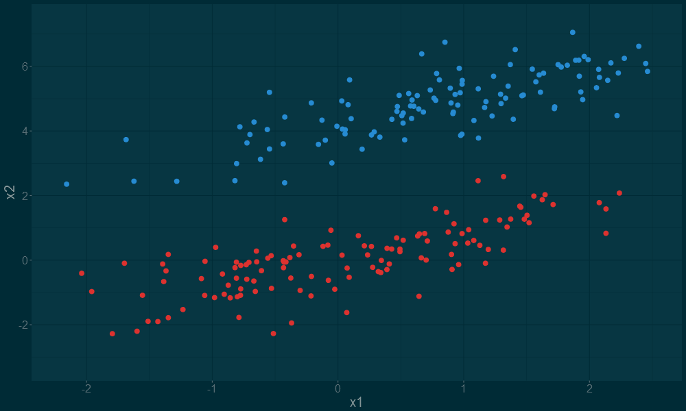
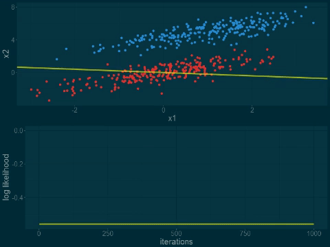
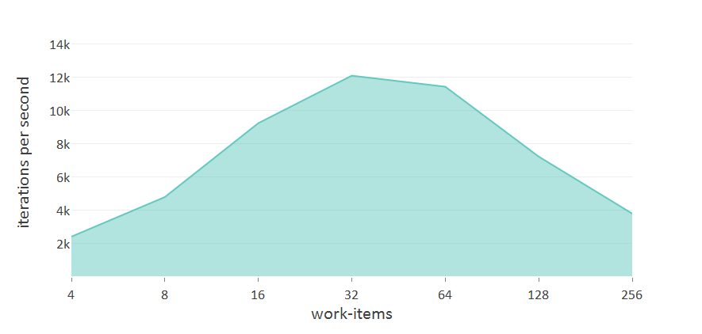
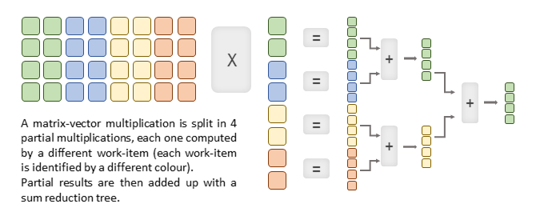
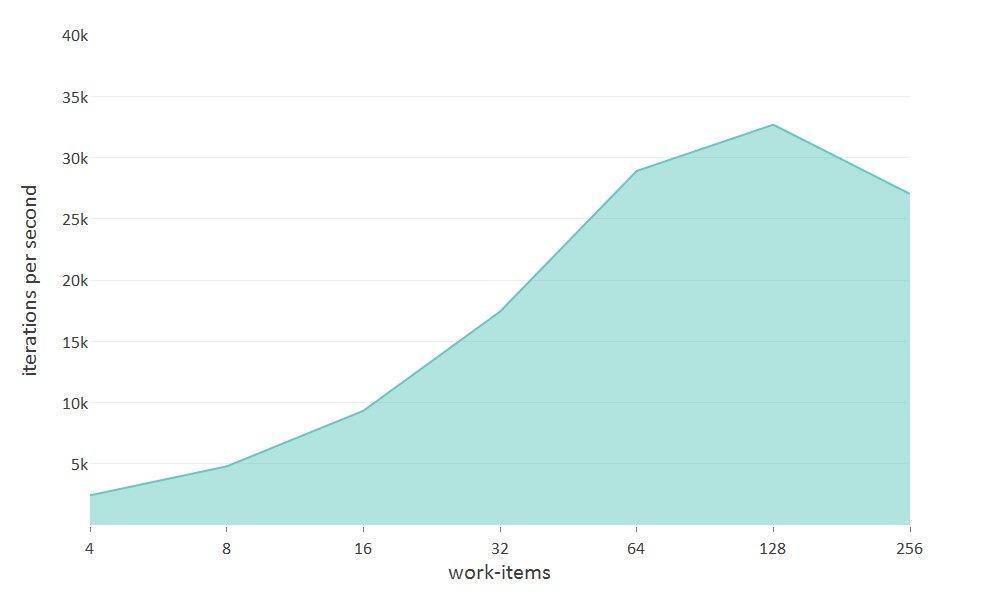
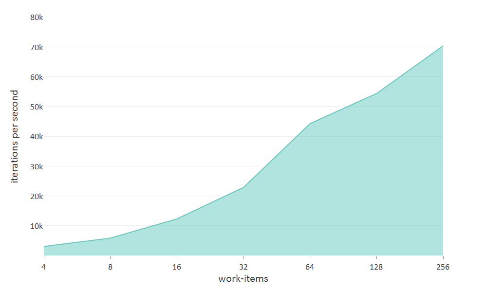
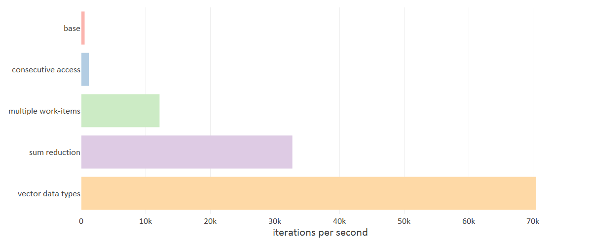

# logReg
OpenCL Logistic Regression with gradient ascent


## logistic regression
Long story short, the goal of logistic regression is to estimate a model that can predict the probability of a binary output (1 or 0, true or false, red or blue) given one or more features of an input. The estimated probability can be used in a classification rule (example: the input is classified as a 1 if the estimated probability is greater than 0.5 and as a 0 otherwise).

Consider a set of points on a 2D plane, split in two groups labeled as red and blue. A trained logistic regression model can be used to estimate the probability of a new point belonging to the blue group and the red group:
given features x0 and x1 of the new point, the probability of it being part of the blue group is computed through the hypothesis function P=g(x)=1/(1+e−(x0w0+x1w1)). P ranges from 0 to 1 (because of the sigmoid function) and 1−P is the probability of the new point being a red group one.



Points as a whole (both blue and red points) constitute the "training set". Each point is an example from the training set. 
Each example is characterized by its "features" **x0**, **x1**, etc... (x, y coordinates in the 2D plane example above) and a binary "label" **y** (e.g. 1 if the point belongs to the blue group and 0 if it belongs to the red group).


## gradient ascent

The goal of the training process is to tune the hypothesis function to have an output value close to one for training examples whose label is equal to 1, and an output close to 0 for training examples with label equal to 0.

Skipping all math and linear algebra related narration (http://cs229.stanford.edu/notes/cs229-notes1.pdf), a linear regression model can be trained with 3 lines of R code:

scores <-  labels - sigmoid(features%*%weights)
gradients <- t(features)%*%errors
weights <- weights + LEARNING_RATE*gradients

**features** is a JxK matrix where J equals the number of examples in the training set and K the number of features for each example. **labels** is a column vector containing the labels for all the training set examples. The training set is generated by sampling from two multivariate normal distributions (one for the blue points and one for the red points).

The animation below shows log-likelihood function moving toward its maximum (0) when running multiple training iterations.




# openCL implementation and performance tuning

Feature matrix is stored in a vector of j∗k elements. Matrix elements are stored in row-major order (features from the same examples are contiguous in memory). Weights and labels are stored in vectors as well.

Each line of the R code iteration is translated into a corresponding loop.

```c
void kernel logReg(float* features, float* labels, float* weights)
{
  int i, j, k;  
  float scores[NUM_EXAMPLES];
  float gradients[NUM_FEATURES];
  
  for (i = 0; i < NUM_ITERATIONS; i++)
  {
    // loop 1: (scores <- trainingSetLabels - sigmoid(trainingSetFeatures%*%weights))
    for(j = 0; j < NUM_EXAMPLES; j++)
    {      
      float score = 0.0f;
      for(k = 0; k < NUM_FEATURES; k++)
        score += features[j*NUM_FEATURES + k] * weights[k];
      
      scores[j] = labels[j] - 1/(1 + exp(-score));
    }
    
    // loop 2: (gradients <- t(trainingSetFeatures)%*%scores)
    for(k = 0; k < NUM_FEATURES; k++)
    {
      gradients[k] = 0.0f;
      for(j = 0; j < NUM_EXAMPLES; j++)
        gradients[k] += features[j*NUM_FEATURES + k] * scores[j];
    }
      
    //  loop 3: (weights <- weights*(1-LEARNING_RATE*REGULARIZATION) + LEARNING_RATE*gradients)
    for(k = 0; k < NUM_FEATURES; k++)
      weights[k] += gradients[k]*LEARNING_RATE;
  }
}
```

The elapsed time for 50000 algorithm iterations on a training set of 2048 examples with 8 features each is more than 100 seconds (!) on my laptop crappy GPU (Radeon R7 M360).

###Consecutive Memory Access

In **Loop 2** , the inner loop over NUM_EXAMPLES (loop index j) is accessing non-consecutive memory elements of the features matrix (features[j*NUM_FEATURES + k]).

Better memory access is achieved by inverting the loop order:

```c
for(j = 0; j < NUM_EXAMPLES; j++)
{
   for(k = 0; k < NUM_FEATURES; k++)
     gradients[k] += features[j*NUM_FEATURES + k] * scores[j];
}
```

Loop 1 and loop 2 can be merged together:

```c
__kernel void kernel logReg(__constant float* features, __constant float* labels, __global float* weights)
{
  int i, j, k;  
  float score;
  float gradients[NUM_FEATURES];
  
  for (i = 0; i < NUM_ITERATIONS; i++)
  {        
    for(k = 0; k < NUM_FEATURES; k++)
      gradients[k] = 0.0f;
    
    // loop 1
    for(j = 0; j < NUM_EXAMPLES; j++)
    {
      score = 0.0f;
      for(k = 0; k < NUM_FEATURES; k++)
        score += features[j*NUM_FEATURES + k] * weights[k];
      
      score = labels[j] - 1/(1 + exp(-score));
      
      for(k = 0; k < NUM_FEATURES; k++)
        gradients[k] += features[j*NUM_FEATURES + k] * score;
    }
      
    // loop 2
    for(k = 0; k < NUM_FEATURES; k++)
      weights[k] += gradients[k]*LEARNING_RATE;
  }
}
```

Elapsed time is now 43.43 seconds (1151 iterations per second).

###Multiple work-items

Some parallelism is introduced in loop 1 by splitting the work-load among parallel work-items (parallel threads in OpenCL). Each work-item computes a portion of the loop (partialGradient), and the results is summed together once all the work-items completed their work.

Parallelism is achieved leveraging two OpenCL features:
- local memory: used to share data between different work-items in the group, in order to allow the final sum to be computed
- memory barriers: needed to synchronize the work-items so that code will not proceed until all work items reach the barrier

```c
__kernel void kernel logReg(__constant float* features, __constant float* labels, __global float* weights)
{
  int localId= get_local_id(0);
  const int localExamplesStart = NUM_EXAMPLES/NUM_WORK_ITEMS*localId;
  
  int i, j, k;  
  float score;
  __local float partialGradients[NUM_FEATURES*NUM_WORK_ITEMS];
  
  for (i = 0; i < NUM_ITERATIONS; i++)
  {        
    for(k = 0; k < NUM_FEATURES; k++)
      partialGradients[localId*NUM_FEATURES + k] = 0.0f;
    
    // loop 1
    for(j = 0; j < NUM_EXAMPLES/NUM_WORK_ITEMS; j++)
    {
      score = 0.0f;
      for(k = 0; k < NUM_FEATURES; k++)
        score += features[(localExamplesStart+j)*NUM_FEATURES + k] * weights[k];
      
      score = labels[localExamplesStart+j] - 1/(1 + exp(-score));
      
      for(k = 0; k < NUM_FEATURES; k++)
        partialGradients[localId*NUM_FEATURES + k] += features[(localExamplesStart+j)*NUM_FEATURES + k] * score;
    }
    barrier(CLK_LOCAL_MEM_FENCE);
    
    if (localId == 0)
    {
      // loop 2
      for(k = 0; k < NUM_FEATURES; k++)
      {
        for (j = 1; j < NUM_WORK_ITEMS; j++)
          partialGradients[k] += partialGradients[j*NUM_FEATURES + k];
      }
      
      // loop 3
      for(k = 0; k < NUM_FEATURES; k++)
        weights[k] += partialGradients[k]*LEARNING_RATE;      
    }
    barrier(CLK_GLOBAL_MEM_FENCE);
  }
}
```

Performance of this implementation stongly depends on the number of work-items used (more work-items equals more parallelism). Chart below shows the increase in iterations per second with the number of work-items.

Interestingly enough, when the number of work-items is greater than 32, performance starts to degrade.




###Sum Reduction

The bottleneck is when partial gradients are summed together.

Partial greadients sum is computed by work-item 0 (localId == 0) through a loop accumulation. Better performance is achieved by splitting the sum among different work-items with a sum reduction. 

We take advantage of associativity to split up the computation in partial sums computed by different work-items, and then add-up the results. For example, a+b+c+d=(a+b)+(c+d). (a+b) is computed in parallel with (c+d). This principle is applied to larger sums using a reduction tree.



Code below implements the sum reduction process:

```c
for(offset = NUM_WORK_ITEMS/2; offset > 0; offset >>= 1)
{ 
  for (k = 0; k < NUM_FEATURES; k++)
    partialGradients[localId*NUM_FEATURES + k] += partialGradients[(localId+offset)*NUM_FEATURES + k]; 
  barrier(CLK_LOCAL_MEM_FENCE);
}
barrier(CLK_LOCAL_MEM_FENCE);

if (localId == 0)
{
  for(k = 0; k < NUM_FEATURES; k++)
    weights[k] += partialGradients[k]*LEARNING_RATE;      
}
barrier(CLK_GLOBAL_MEM_FENCE);
```

Execution speed is considerably improved when a high number of work-items is used, but still there's a bend in the curve.



###Vector Types

Column dimension lacks parallelism. As well as work-items parallelism, OpenCL vector-types bring additional speed-up.
The code is refactored to use float4 vectors (each vector contains 4 float values) when accessing the feature matrix and performing related computations.
There's no need to transform the feature matrix from scalar (float) into vector type: simply cast the pointers to float4 in the OpenCL kernel. The weights pointer is also cast to float4 as well as the partialProducts vector.

As data-types are now vectors (float4) all indices must be divided by a factor of 4. A conversion from vector to scalar type  is needed to compute the score value. OpenCL dot(x, y) operation is used to compute the dot product between four features and four weight stored in float4 data-types.

```c
__kernel void kernel logReg(__constant float4* features, __constant float* labels, __global float4* weights)
{
  int localId= get_local_id(0);
  const int localExamplesStart = NUM_EXAMPLES/NUM_WORK_ITEMS*localId;
  
  int i, j, k, offset;  
  float score;
  __local float4 partialGradients[NUM_FEATURES/4*NUM_WORK_ITEMS];
  
  for (i = 0; i < NUM_ITERATIONS; i++)
  {        
    for(k = 0; k < NUM_FEATURES/4; k++)
      partialGradients[localId*NUM_FEATURES/4 + k] = 0.0f;
    
    for(j = 0; j < NUM_EXAMPLES/NUM_WORK_ITEMS; j++)
    {
      score = 0.0f;
      for(k = 0; k < NUM_FEATURES/4; k++)
        score += dot(features[(localExamplesStart+j)*NUM_FEATURES/4 + k], weights[k]);
      
      score = labels[localExamplesStart+j] - 1/(1 + exp(-score));
      
      for(k = 0; k < NUM_FEATURES/4; k++)
        partialGradients[localId*NUM_FEATURES/4 + k] += features[(localExamplesStart+j)*NUM_FEATURES/4 + k] * score;
    }
    barrier(CLK_LOCAL_MEM_FENCE);
 
    for(offset = NUM_WORK_ITEMS/2; offset > 0; offset >>= 1)
    { 
      for (k = 0; k < NUM_FEATURES/4; k++)
        partialGradients[localId*NUM_FEATURES/4 + k] += partialGradients[(localId+offset)*NUM_FEATURES/4 + k]; 
      barrier(CLK_LOCAL_MEM_FENCE);
    }
    barrier(CLK_LOCAL_MEM_FENCE);
    
    if (localId == 0)
    {
      for(k = 0; k < NUM_FEATURES/4; k++)
        weights[k] += partialGradients[k]*LEARNING_RATE;      
    }
    barrier(CLK_GLOBAL_MEM_FENCE);
  }
}
```

No bending in the curve is present and a maximum speed of 70k iterations per second is achieved when using 256 work-items.



##Conclusions
- **memory access optimization**: loop ordering has been inverted so that consecutive location memory are accessed in the innermost loop
- **parallel threads execution**: work load (a matrix by vector multiplication) is split among different OpenCL work-items running on parallel threads on the GPU
- **parallel sum reduction**: again leveraging GPU parallelism to speed-up the sum of multiple elements
- **vector data types**: float4 vector type is used, enabling mapping of vector data directly to the hardware vector registers, thus improving both computation and data handling speed



# build
makefile included. Targets are intel, amd and nvidia. Linux Only.

        make target (eg. make intel)

then run with 

        ./run{target} (eg ./runintel)

